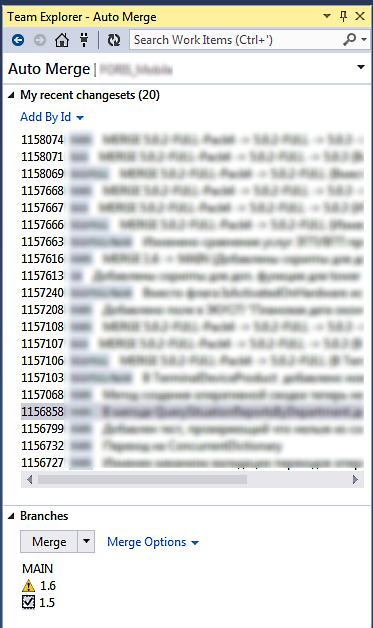

# Auto Merge
**Easy way to merge changeset**

TFS changeset simple merge.
Usefull when need merge bugfix chageset to several branches.

## Features
* Validate target folder (mapped, user has rights, already merged)
* Get latest source before merge
* Associate changeset with same workitem
* Add comment
* Easy way discard/force merge
* Check-In after merge or only fill pending changes page
* Double click open changeset details

## Usage
On team explorer page select Auto Merge. Extension show last changesets and list of branches. You select branches and press merge. That's all.

Team explorer home page

Auto Merge page

## Issues
[https://github.com/CDuke/AutoMerge/issues](https://github.com/CDuke/AutoMerge/issues)